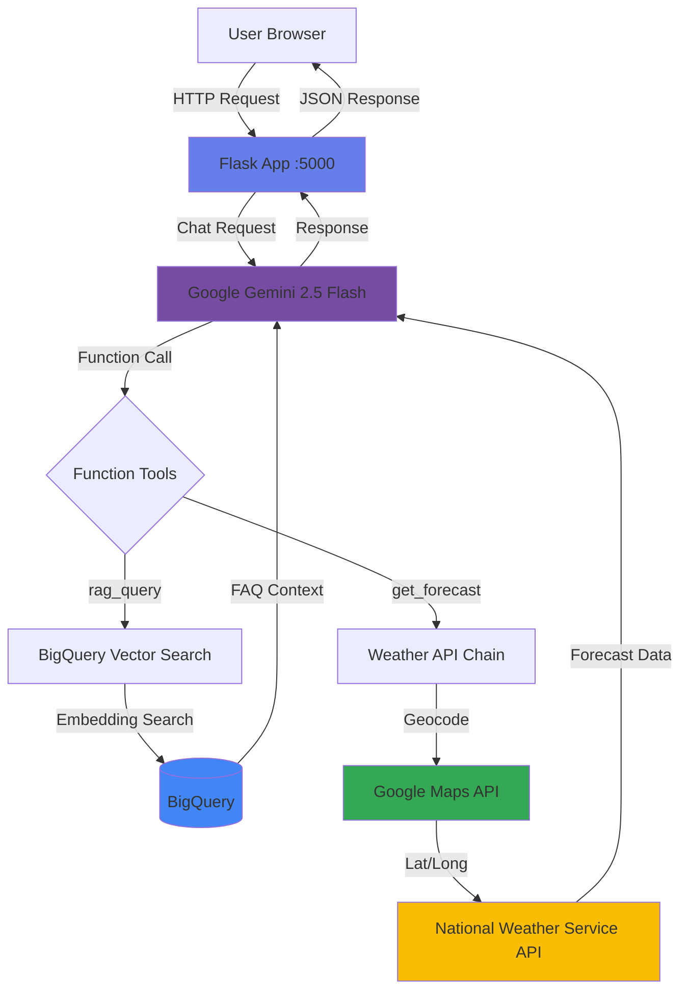
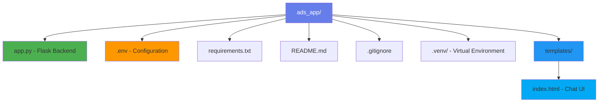

# Alaska Department of Snow (ADS) Chat App

A simple local Flask chat application for demoing the ADS chatbot with RAG and weather forecast capabilities.

## Setup Instructions

### 1. Activate Virtual Environment and Install Dependencies

```bash
cd ads_app

# Activate the virtual environment
source .venv/bin/activate

# Install dependencies
pip install -r requirements.txt
```

### 2. Configure Environment Variables

Edit the `.env` file and replace the placeholder values:

```bash
# Required:
GCP_PROJECT_ID=your-actual-project-id
GOOGLE_MAPS_API_KEY=your-actual-google-maps-api-key

# Optional (defaults are set):
GCP_LOCATION=us-central1
MODEL_NAME=gemini-2.5-flash
DATASET_NAME=alaska_dept_faq_db
```

### 3. Set up Google Cloud Authentication

Make sure you're authenticated with Google Cloud:

```bash
gcloud auth application-default login
```

### 4. Run the Application

```bash
# Make sure virtual environment is activated
source .venv/bin/activate

# Run the app
python app.py
```

The app will start on http://localhost:5000

## Features

- **RAG-powered FAQ**: Uses BigQuery vector search to answer questions about Alaska's Department of Snow
- **Weather Forecasts**: Get weather forecasts for any city in Alaska using the National Weather Service API
- **Simple Chat Interface**: Clean, minimal web UI for chatting with the bot

## Usage

1. Open http://localhost:5000 in your browser
2. Type questions like:
   - "What does ADS do?"
   - "What's the weather in Anchorage?"
   - "Tell me about snow removal policies"

## Architecture

### Application Flow



### Services & APIs Used

```
┌─────────────────────────────────────────────────────────────────────────────────────┐
│                              FRONTEND LAYER                                         │
│  ┌──────────────────┐      ┌──────────────────┐      ┌──────────────────┐         │
│  │  Web Browser     │ ---> │ HTML/CSS/JS      │ ---> │ Chat Interface   │         │
│  └──────────────────┘      └──────────────────┘      └──────────────────┘         │
└─────────────────────────────────────────────────────────────────────────────────────┘
                                          │
                                          │ HTTP POST /chat
                                          ▼
┌─────────────────────────────────────────────────────────────────────────────────────┐
│                               BACKEND LAYER                                         │
│  ┌──────────────────┐      ┌──────────────────┐      ┌──────────────────┐         │
│  │  Flask Server    │ <--> │   app.py         │ <--> │  .env Config     │         │
│  │  (Port 5000)     │      │  Main App Logic  │      │                  │         │
│  └──────────────────┘      └──────────────────┘      └──────────────────┘         │
└─────────────────────────────────────────────────────────────────────────────────────┘
                                          │
                                          │ Generate Response
                                          ▼
┌─────────────────────────────────────────────────────────────────────────────────────┐
│                         GOOGLE CLOUD PLATFORM                                       │
│                                                                                     │
│  ┌────────────────────────────────────────────────────────────────────────┐        │
│  │                     Gemini 2.5 Flash (LLM)                             │        │
│  │                      Function Calling Engine                           │        │
│  └────────────────────────────────────────────────────────────────────────┘        │
│            │                                          │                             │
│            │ Function Call: rag_query                 │ Function Call: get_forecast │
│            ▼                                          ▼                             │
│  ┌──────────────────────┐                  ┌──────────────────────┐               │
│  │  BigQuery            │                  │  Google Maps API     │               │
│  │  Vector Search       │                  │  Geocoding Service   │               │
│  │  ┌────────────────┐  │                  └──────────────────────┘               │
│  │  │ FAQ Database   │  │                            │                             │
│  │  │ (Embeddings)   │  │                            │ Lat/Long                    │
│  │  └────────────────┘  │                            ▼                             │
│  └──────────────────────┘                  ┌──────────────────────┐               │
│            │                                │  app.py handles      │               │
│            │ FAQ Context                    │  coordinate data     │               │
│            ▼                                └──────────────────────┘               │
│       Back to Gemini                                 │                             │
└──────────────────────────────────────────────────────┼─────────────────────────────┘
                                                       │ Coordinates
                                                       ▼
┌─────────────────────────────────────────────────────────────────────────────────────┐
│                            EXTERNAL APIs                                            │
│  ┌────────────────────────────────────────────────────────────────────────┐        │
│  │              National Weather Service API                              │        │
│  │              Forecast Data (JSON)                                      │        │
│  └────────────────────────────────────────────────────────────────────────┘        │
└─────────────────────────────────────────────────────────────────────────────────────┘
                                          │
                                          │ Weather JSON
                                          ▼
                               Back to app.py → Gemini → Flask → User
```

### Project Structure



## Notes

- This is a local demo app with no authentication or security features
- Requires active GCP project with BigQuery datasets configured
- No containerization or production deployment setup
